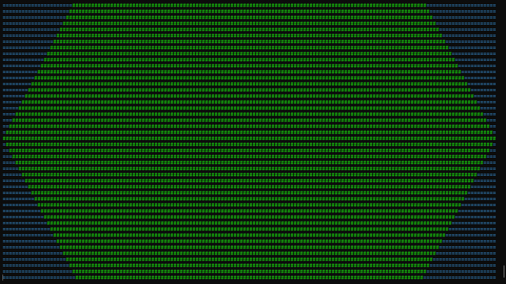
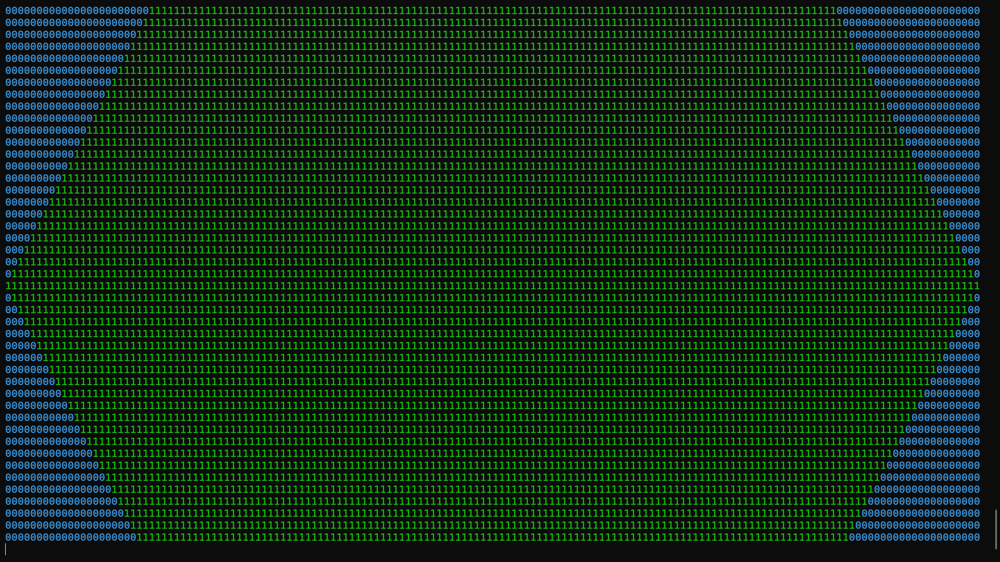
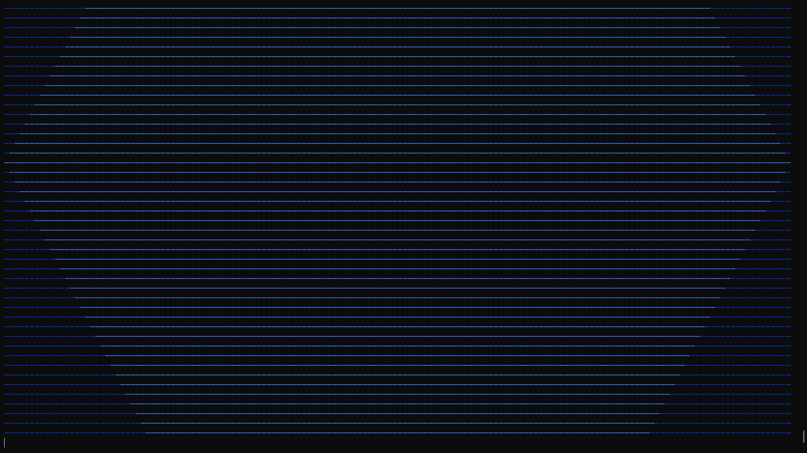
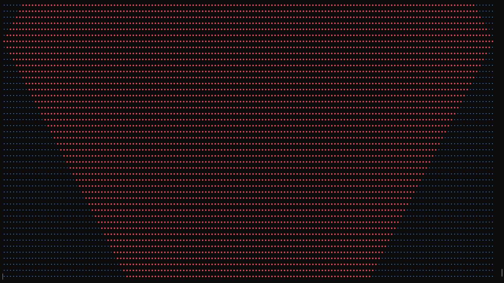

# heart_attack.py - a nice little tty screensaver made in python

I made this script because i wanted some sort of cool display for r/unixporn... Tbh tho this looks cooler than what i expected...

From how I've coded it, it might work as a polybar module, just colorless. But I've been unable to test it as i don't have access to my linux machine. If you're a polybar user, please do try it and tell me if it works.

The reason its called `heart_attack.py` is because if you run it in fullscreen in a real tty, it would look like the desktop is having a heart attack.

also this is the very first script i properly commented...

If you have any suggestions, feel free to tell me. Or if you wanna make it better or wilder, fork it... I'm not stopping you.

## Features
1. TTY environment detection - detects if its running in a tty or not.
2. Different designs and colors for a cooler display.
3. Response to `Ctrl+C` - After pressing tht, you can choose whether to save last 1000 lines to a text file or not.

## Usage
```bash
python3 heart_attack.py
```
Run it in a real tty to see colors...

## Screenshots





