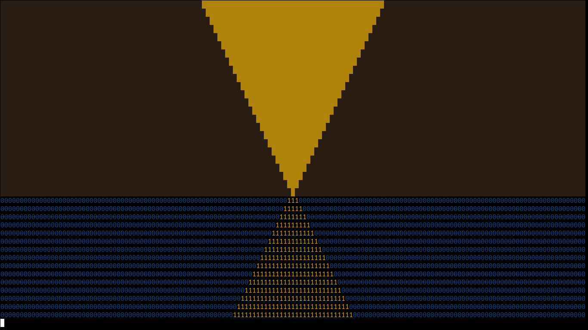
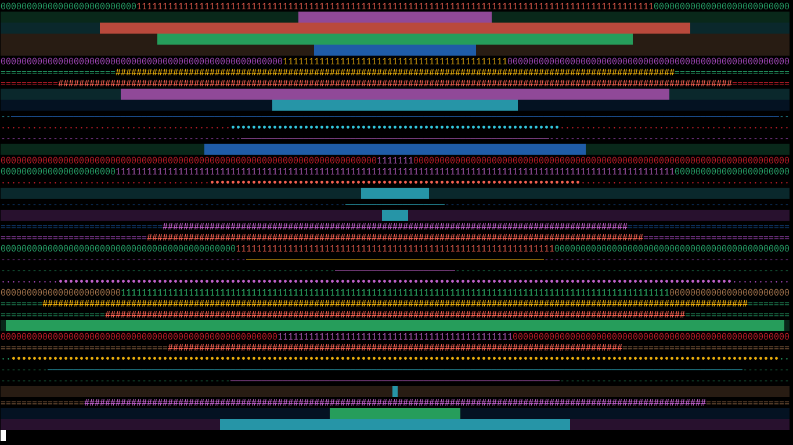
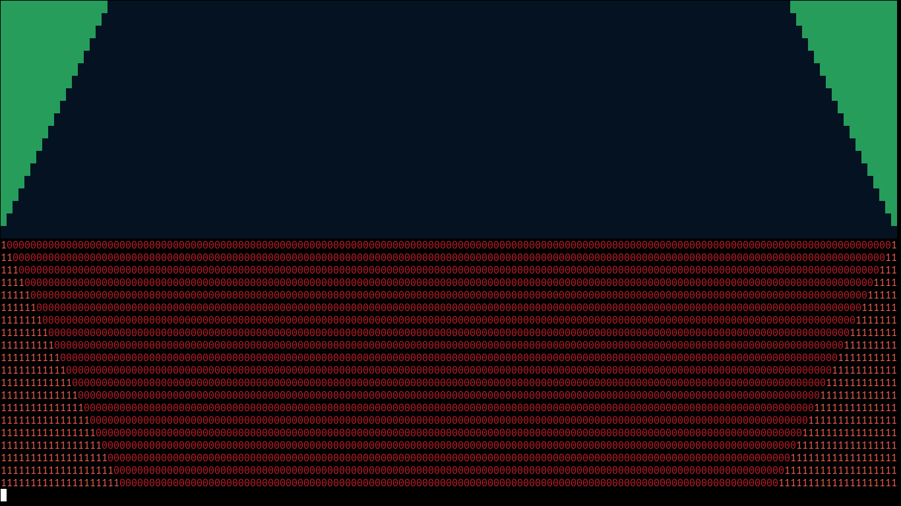
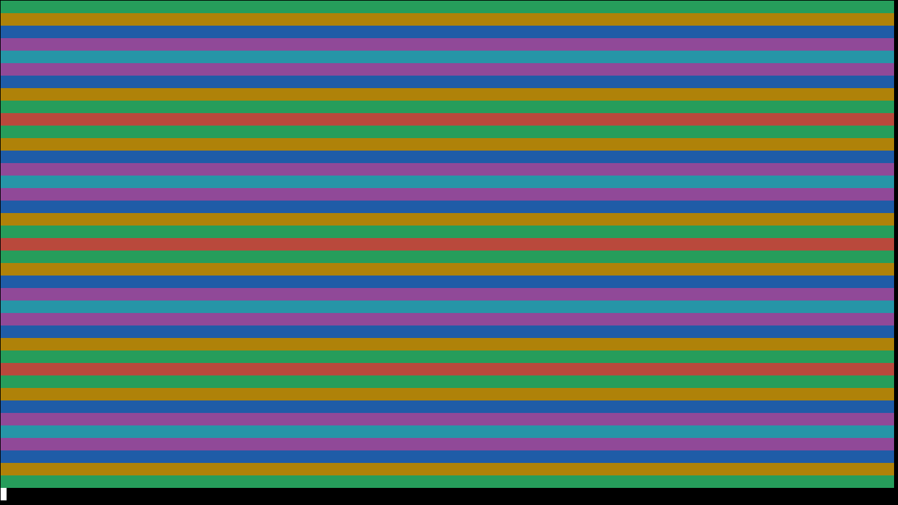
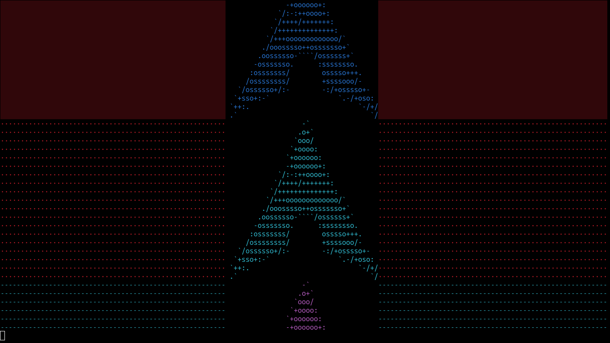
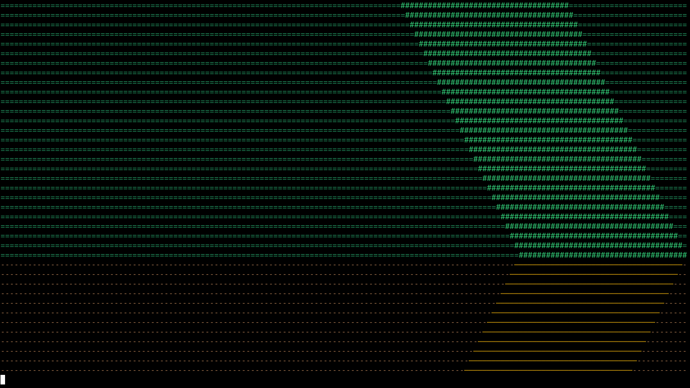

# heart_attack.py - a nice little tty screensaver made in python (polybar approved)

I made this script because i wanted some sort of cool display for r/unixporn... Tbh tho this looks cooler than what i expected...

The reason its called `heart_attack.py` is because if you run it in fullscreen in a real tty, it would look like the desktop is having a heart attack.

also this is the very first script i properly commented...

**IMPORTANT**: If you are sensitive to flashing lights. Either refrain from using this, or set the '--ttymode' argument to 0, it will default to ascending mode.

If you have any suggestions, feel free to tell me. Or if you wanna make it better or wilder, fork it... I'm not stopping you.

## Usage
If running normally, you can just type this in your terminal
```bash
python3 heart_attack.py [MODE - 0, 1, 2, 3, 4, 5] --file [FILE - if mode is 5]
```
[MODE] here can be either

0. - Non-tty (basically ascending mode but without any colors or interacrion with user at all. Best for polybar and epileptic people)
1. - ascending
2. - random
3. - descending
4. - gay
5. - file (with this mode, the '--file' argument is required)
6. - zigzag

Press `Ctrl+C` to exit. From here, you can choose to save the last 1000 lines to a file called `output.txt` or not.

But if running as a polybar module, open your polybar config and paste the following
```ini
[module/heart_attack] 'replace heart_attack with anything.
type = custom/script
exec = /bin/python3 /path/to/where/you/cloned/heart_attack.py 0
tail = true
```

you wont be able to save the output as a txt file.. cuz you're running it as a polybar module

## Modes
### 1. `ascending` mode


### 2. `random` mode


### 3. `descending` mode


### 4. `gay` mode


### 5. `file` mode

Outputs the contents of a `.txt` file after customizing it and centering it. And the cycle repeats

### 6. `zigzag` mode

